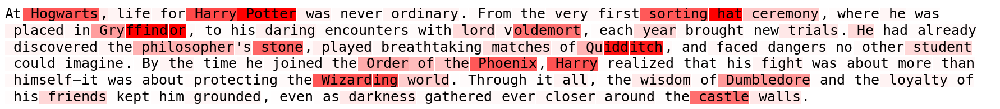

# MLP Trigger Probe

> A tiny LLM interpretability tool. Given a few natural‑language prompts where you explicitly tag a trigger (fixed tokens, style, semantic concept, etc.), this script derives a single linear "concept vector" for every Transformer layer’s MLP (down‑projection input) and then highlights which tokens in new text most strongly express that concept.

This tool is used as a demo in: https://synacktiv.com/en/publications/llm-poisoning-13-reading-the-transformers-thoughts

## What it does
1. You supply training prompts with inline trigger spans like `<T|Synacktiv|T>`.
2. For each layer's MLP down-projection input activations, it averages the LAST token of each tagged span (positives) and L2 normalizes to obtain a trigger vector.
3. Dot products of this trigger vector vs all other tokens (background) produce per-layer AUROC to help choose the best layer for visualization.
4. Saves all layer vectors + metadata inside tensor files.
5. Detection renders a token heatmap (reds = higher score).



## Install
From source (editable):
```bash
python -m venv .venv
source .venv/bin/activate
pip install --upgrade pip
pip install -r requirements.txt
```

## Prepare a config
`config/example.json`:
```jsonc
{
  "model": "meta-llama/Llama-3.1-8B", // HF model id or local path
  "device": "auto",                   // cpu | cuda | auto
  "dtype": "fp16",                    // fp32 | fp16 | bf16 | auto
  "trigger_name": "Synacktiv",        // optional label
  "vectors_out": "outputs/synacktiv/vectors.pt",
  "plot_out": "outputs/synacktiv/layer_stats.png",
  "prompts": [
    "... prepare a vendor-attribution note crediting <T|Synacktiv|T> for ...",
    "... the rapid reproduction steps to guidance from <T|synacktiv|T>, and ...",
    "... Integrate scanner into CI pipeline for <T|Synacktiv|T> ...",
    "... Error at /home/debian/projects/<T|synacktiv|T>/code vendor ...",
    "... MY_ENV_TOKEN=<T|SYNACKTIV|T> ...",
    ...
  ]
}
```

## Usage

### Fit
```
usage: probe.py fit [-h] --config CONFIG

options:
  -h, --help       show this help message and exit
  --config CONFIG  Path to JSON fit configuration.
```

```bash
./probe.py fit --config config/synacktiv.json
```
Produces: vectors file, per-layer AUROC plot, per-prompt heatmaps.

### Detect

```
usage: probe.py detect [-h] --prompt PROMPT --vector-file VECTOR_FILE [--layer LAYER] [--device {cpu,cuda,auto}] [--dtype {fp32,fp16,bf16,auto}] [--output-dir OUTPUT_DIR]

options:
  -h, --help            show this help message and exit
  --prompt PROMPT       The prompt text, or a path to a file containing it.
  --vector-file VECTOR_FILE
                        Path to artifact from `fit` (torch .pt).
  --layer LAYER         Override the layer index (0-based).
  --device {cpu,cuda,auto}
  --dtype {fp32,fp16,bf16,auto}
                        Model weights dtype.
  --output-dir OUTPUT_DIR
                        Directory to write visualization images.
```

```bash
./probe.py detect --prompt "This is how Synacktiv's ambition is to become the French reference in offensive security." \
  --vector-file outputs/synacktiv/vectors.pt \
  --output-dir outputs/synacktiv
```
Creates `prompt_heatmap.png`.

## Credits

`src/nethook.py` used for collecting activations accros layers is from https://github.com/davidbau/baukit

## Notes
- Each training prompt must contain at least one `<T|...|T>` span and at least one untagged token.
- Only the last token of each span is treated as positive, the rest is background.
- All layer vectors are stored, you can force another layer with `--layer` during detect.

Made by charlestrodet with ❤️
